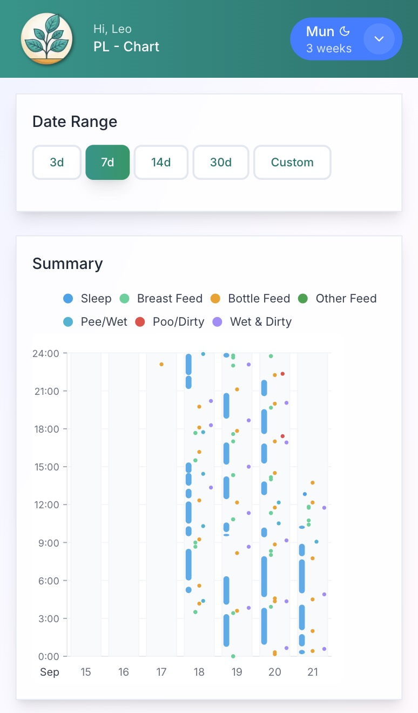

# Baby Tracker (PLM Version)
Modified and based on Original Application: Sprout Track (https://github.com/Oak-and-Sprout/sprout-track)

### What's difference from original version? (Updated 23 Sep 2025)
- Fixed time picker to automatically switch to minute selection
- Fixed feeding default unit in Quick Stats
- Allow to use keyboard at login screen for desktop user
- Added new unit (drops) in medicine section
- Added chart function to have an overview about entries
- Added note function for feed entry
- Added tool to reset admin password
- Added setting to enable/disable swiping to change date in log entry
- Change Setup Wizard logic
- Add support for Hermes notification service when it's time for feeding or diary (can notify in advance 1/5/10/15/30 mins)

### Prerequisites

- Git (to clone the repository)
- Node.js (v22+) and NPM (v10+)
- Bash shell (for running the setup script)

### Quick Setup (Recommended)

1. Clone the repository:
```bash
git clone https://github.com/leonguyen52/sprout-track.git
cd sprout-track
```

2. If deploying to a restricted directory (like /var/www), set proper permissions:
```bash
# For standard web server directories like /var/www
sudo chown -R $(whoami):$(whoami) .
# Or specify your web server user (e.g., www-data)
# sudo chown -R www-data:www-data .
```

3. Give execute permissions to the scripts folder:
```bash
chmod +x scripts/*.sh
```

4. Run the setup script:
```bash
./scripts/setup.sh
```

## Screenshots

<table>
  <tr>
    <td width="33%"><br/><em>Mobile-first app for tracking your child's activities</em></td>
    <td width="33%"><br/><em>Dark mode for late night feedings</em></td>
    <td width="33%"><br/><em>Responsive design for larger devices</em></td>
  </tr>
  <tr>
    <td width="33%"><br/><em>Quick entry for logging activities</em></td>
    <td width="33%"><br/><em>Comprehensive searchable activity log</em></td>
    <td width="33%"><br/><em>Calendar for tracking events and reminders</em></td>
  </tr>
  <tr>
    <td width="33%"><br/><em>Secure login with IP-based lockout</em></td>
    <td width="33%"><br/><em>User-friendly setup wizard</em></td>
    <td width="33%"><br/><em>Chart Function for quick activities overview</em></td>
  </tr>
</table>

## Live Demo (From Original Version, I don't provide demo for my modified version)

Try out Sprout Track at our live demo: **[https://www.sprout-track.com/demo](https://www.sprout-track.com/demo)**

*The demo environment is refreshed every 1 hour.*

### Demo Login Information

- ID: `01`
- PIN: `111111`

### Quick Docker Deployment

  


To deploy the latest version using Docker:

#### For image pulls:
x64:
```bash
docker pull sprouttrack/sprout-track:0.94.24x64
```

arm64:
```bash
docker pull sprouttrack/sprout-track:0.94.24arm64
```
#### Build locally
```bash
docker-compose up -d
```

## Table of Contents

- [Tech Stack](#tech-stack)
- [Getting Started](#getting-started)
  - [Prerequisites](#prerequisites)
  - [Quick Setup (Recommended)](#quick-setup-recommended)
  - [Manual Setup (Alternative)](#manual-setup-alternative)
  - [Default Security PIN](#default-security-pin)
- [Initial Application Setup](#initial-application-setup)
  - [Setup Wizard](#setup-wizard)
- [Available Scripts](#available-scripts)
  - [Next.js Server/Dev Scripts](#nextjs-serverdev-scripts)
  - [Customizing Port Numbers](#customizing-port-numbers)
  - [Database Scripts](#database-scripts)
  - [Utility Scripts](#utility-scripts)
  - [Updating the Application](#updating-the-application)
- [Environment Variables](#environment-variables)

## Tech Stack

- Next.js with App Router
- TypeScript
- Prisma with SQLite (`/prisma`)
- TailwindCSS for styling
- Docker for containerization (optional)

## Getting Started

### Prerequisites

- Git (to clone the repository)
- Node.js (v22+) and NPM (v10+)
- Bash shell (for running the setup script)

### Quick Setup (Recommended)

1. Clone the repository:
```bash
git clone https://github.com/leonguyen52/sprout-track.git
cd sprout-track
```

2. If deploying to a restricted directory (like /var/www), set proper permissions:
```bash
# For standard web server directories like /var/www
sudo chown -R $(whoami):$(whoami) .
# Or specify your web server user (e.g., www-data)
# sudo chown -R www-data:www-data .
```

3. Give execute permissions to the scripts folder:
```bash
chmod +x scripts/*.sh
```

4. Run the setup script:
```bash
./scripts/setup.sh
```

This setup script will:
- Install all dependencies
- Generate the Prisma client
- Run database migrations
- Seed the database with initial data (default PIN: 111222)
- Build the Next.js application

After setup completes, you can run the application in development or production mode as instructed in the setup output.

### Manual Setup (Alternative)

If you prefer to set up manually or the setup script doesn't work for your environment:

1. Ensure Node.js (v22+) and NPM (v10+) are installed

2. Install dependencies:
```bash
npm install
```

3. Generate Prisma client:
```bash
npm run prisma:generate
```

4. Run database migrations:
```bash
npm run prisma:migrate
```

5. Seed the database:
```bash
npm run prisma:seed
```
### To run the development server:
```bash
npm run dev
```

### To run the production server:
1. Build the application:
```bash
npm run build
```
2. Run the production server:
```bash
npm run start
```

Open [http://localhost:3000](http://localhost:3000) with your browser to see the result.

### Default Security PIN and Family-Manager Password

The default security PIN after setup is: **111222**

Default [/family-manager](/family-manager) password is: **admin**
Note: The family manager settings page is where you can set domain, whether to use https://, email settings, and download the database.  **It's recommended you download the database before each upgrade.**

## Initial Application Setup

After installation, when you first access the application, you'll be guided through a setup wizard that helps you configure the essential settings for your Sprout Track instance.

### Setup Wizard

The application includes a built-in Setup Wizard (`src/components/SetupWizard`) that walks you through the following steps:

1. **Family Setup**
   - Enter your family name and link/slug
   - On initial setup you can import data from a previous version (just import the old *.db file from the /db folder)

2. **Security Setup**
   - Choose between a system-wide PIN or individual caretaker PINs
   - For system-wide PIN: Set a 6-10 digit PIN
   - For individual caretakers: Add caretakers with their own login IDs and PINs
     - First caretaker must be an admin
     - Each caretaker needs a 2-character login ID and 6-10 digit PIN

3. **Baby Setup**
   - Enter baby's information (first name, last name, birth date, gender)
   - Configure warning times for feeding and diaper changes
   - Default warning times: Feed (2 hours), Diaper (3 hours)

The Setup Wizard ensures your application is properly configured with the necessary security settings and initial data before you start tracking your baby's activities.


## Available Scripts

### Next.js Server/Dev Scripts

- `npm run dev` - Start development server
- `npm run build` - Build for production
- `npm start` - Start production server
- `npm run lint` - Run ESLint

### Customizing Port Numbers

By default, the application runs on port 3000. To change the port:

1. Open `package.json` in your preferred text editor
2. Locate the "scripts" section
3. Modify the "dev" and/or "start" scripts to include the `-p` flag followed by your desired port number:

```json
"scripts": {
  "dev": "next dev -p 4000",  // Development server will run on port 4000
  "start": "next start -p 8080"  // Production server will run on port 8080
}
```

This change will persist across application updates. For Docker deployments, use the PORT environment variable as described in the Docker section.

### Database Scripts

- `npm run prisma:generate` - Generate Prisma client
- `npm run prisma:migrate` - Run database migrations
- `npm run prisma:seed` - Seed the database with initial data
- `npm run prisma:studio` - Open Prisma Studio to view/edit database

### Setup and Deployment Scripts

- `./scripts/setup.sh` - Complete initial setup (Node.js check, dependencies, database, build)
- `./scripts/env-update.sh` - Check and update environment configuration (creates ENC_HASH if missing)
- `./scripts/update.sh` - Update application (git pull, prisma operations, build)
- `./scripts/deployment.sh` - Full deployment process (backup + update + service management)
- `./scripts/backup.sh` - Create a backup of the application and database
- `./scripts/service.sh {start|stop|restart|status}` - Manage the application service

### Test Data Generation Scripts

- `./scripts/generate-test-data.sh` - Interactive test data generation with customizable parameters
- `./scripts/generate-test-data-automated.sh` - Automated test data generation (for cron jobs/CI/CD)
- `./scripts/generate-test-data.js` - JavaScript data generation logic

### Database Migration Scripts

- `./scripts/family-migration.js` - Migrate existing data for multi-family support
- `./scripts/family-update.sh` - Update database after multi-family migration
- `./scripts/ensure-utc-dates-improved.js` - Convert all database dates to UTC format

### Updating the Application

**1. Backup your database:**  
Before upgrading, it is recommended to back up your `baby-tracker.db` file. You can do this by downloading the file from the settings page in either the main app or the family manager pages.

**2. For Docker deployments:**  
- Stop the old container.
- Pull the latest Docker image.
- Start the new container.
- Import your backed-up database file from the inital setup page.
The import process will automatically handle any required database migrations or updates.

**3. For local (non-Docker) builds:**  
- Run the deployment script:  
  ```bash
  ./scripts/deployment.sh
  ```
  This script will handle all necessary updates and migrations. You do **not** need to re-import your database, as the script manages updates in place.

## Environment Variables

The application can be configured using environment variables in the `.env` file. Here are the available options:

| Variable | Description | Default | Example |
|----------|-------------|---------|---------|
| `DATABASE_URL` | Path to the SQLite database | `"file:../db/baby-tracker.db"` | `"file:/path/to/custom/db.sqlite"` |
| `SERVICE_NAME` | Name of the systemd service | `"baby-tracker"` | `"sprout-track"` |
| `AUTH_LIFE` | Authentication token validity period in seconds | `"86400"` (24 hours) | `"43200"` (12 hours) |
| `IDLE_TIME` | Idle timeout before automatic logout in seconds | `"28800"` (8 hours) | `"3600"` (1 hour) |
| `APP_VERSION` | Application version | `"0.9.0"` | `"1.0.0"` |
| `COOKIE_SECURE` | Whether cookies require HTTPS connections | `"false"` | `"true"` |
| `ENC_HASH` | Encryption hash for admin password security | Auto-generated | 64-character hex string |

### Automatic Environment Setup

The `./scripts/env-update.sh` script automatically manages environment variables:
- Creates `.env` file if it doesn't exist
- Generates a secure `ENC_HASH` (64-character random hex) if missing
- Used during setup and deployment processes

### Important Notes:

- **DATABASE_URL**: Changing this after initial setup requires migrating your data manually.
- **AUTH_LIFE**: Lower values increase security but require more frequent logins.
- **IDLE_TIME**: Determines how long a user can be inactive before being logged out.
- **ENC_HASH**: Automatically generated for admin password encryption; do not modify manually.
- **COOKIE_SECURE**: 
  - Set to `"false"` to allow cookies on non-HTTPS connections (development or initial setup)
  - Set to `"true"` when you have an SSL certificate in place (recommended for production)
  - When set to `"true"`, the application will only work over HTTPS connections
